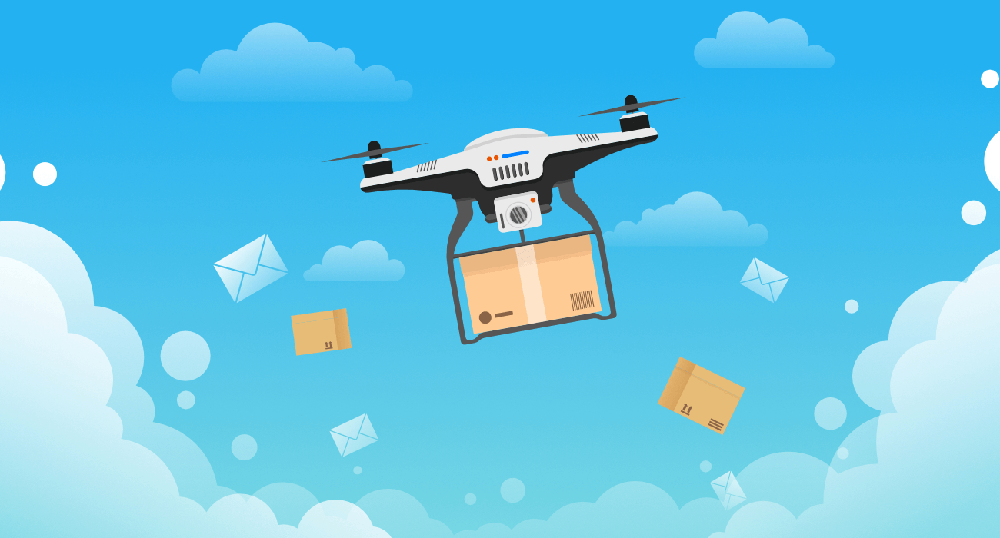

# Dronazon

## Descrizione
Lo scopo del progetto è quello di realizzare un sistema che gestisca le consegne degli ordini ricevuti dal sito di 
e-commerce Dronazon, tramite l’utilizzo  di droni.   
Dronazon ha a disposizione uno stormo di droni distribuiti all’interno di  una smart-city per gestire le proprie consegne. 
I droni della smart-city si devono organizzare per eleggere un drone master.   
Ogni volta che un cliente di Dronazon effettua un nuovo ordine, questa informazione verrà passata al
drone master della smart-city. Il drone master stabilirà poi quale drone si dovrà occupare di tale consegna.   
Ogni drone ha installato un sensore che rileva il livello di inquinamento dell’aria.   
Inoltre, ogni consegna implica un consumo di batteria. Quando il livello di batteria residua di un drone è al di sotto del 15%, 
il drone è costretto ad abbandonare il sistema.  
Periodicamente, i droni devono comunicare ad un server remoto, chiamato Server Amministratore, le informazioni relative:
- al numero di consegne effettuate, 
- al numero di chilometri percorsi,
- al livello di inquinamento dell’aria rilevato
- al livello di batteria rimanente.
  
Gli amministratori di Dronazon potranno monitorare il proprio sistema di consegne attraverso il Server Amministratore.  
Inoltre, tramite il Server Amministratore è anche possibile registrare e rimuovere droni dal sistema dinamicamente.

## Autori
👨‍💻[@federicopiscitelli](https://gitlab.com/federicopiscitelli)  